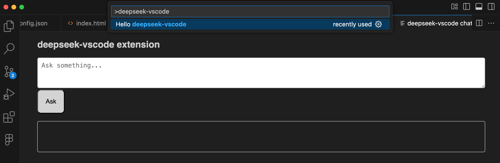

# deepseek-vscode

Just one of the things I'm learning. <https://github.com/hchiam/learning>

Based on this Beyond Fireship video: <https://www.youtube.com/watch?v=clJCDHml2cA>

Actually getting it to work on my machine wasn't as straightforward as copying the code. See notes below.

<p align="center">
  
</p>

## usage

```sh
# SETUP:

cd deepseek-vscode
yarn
tsc
# Ctrl+Shift+P "Developer: Install Extension from Location..."
# select deepseek-vscode folder

# REGULAR USE:

# run Ollama app
# Ctrl+Shift+P "Hello deepseek-vscode"
```

## notes

- initialized using `npx --package yo --package generator-code -- yo code` and setting a bunch of things to "deepseek-vscode" and using the `yarn` option

- <https://code.visualstudio.com/api/get-started/your-first-extension>
  - This example uses the Ctrl+Shift+P command "Hello deepseek-vscode"
  - I had to run `tsc` within this project so that it generates `/out/extension.js`, otherwise I either couldn't get the "Hello deepseek-vscode" command to run or it got an error.
  - you might want to instead run `tsc --watch` so it automatically updates when you make updates

- <https://ollama.com/library/deepseek-r1:1.5b>

- <https://ollama.com/download>
  - run it and it'll help you install the CLI that works when the ollama app is running, for example, this CLI command: `ollama run deepseek-r1:1.5b`

- but within the project, don't want to interact with cli but rather REST API or JS SDK:
  - `npm install ollama`, or
  - `yarn add ollama`

- using es6-string-html VSCode extension by Tobermory is recommended

- TODO: figure out how to _install_ it _locally_ so I don't have to run it in debug.
  - maybe can find inspiration from an older project <https://github.com/hchiam/custom-vscode-linter>
  - UPDATE: actually this works for me:
    1. Ctrl+Shift+P "Developer: Install Extension from Location..."
    2. select the deepseek-vscode folder
    3. Now Ctrl+Shift+P "Hello deepseek-vscode" is available in my VS Code!

- TODO: run other non-deepseek models?
